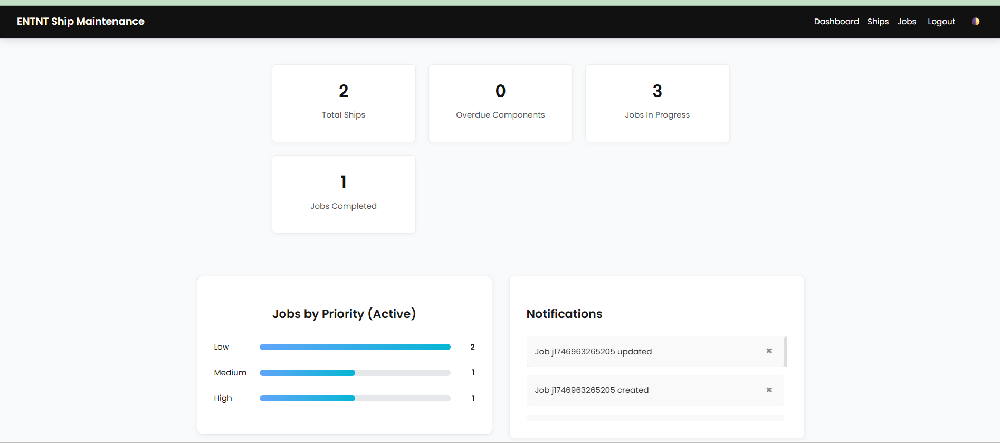
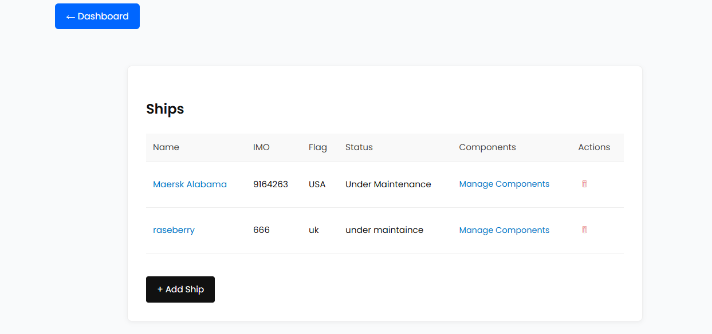
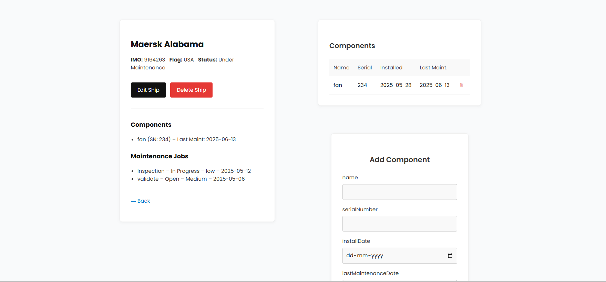
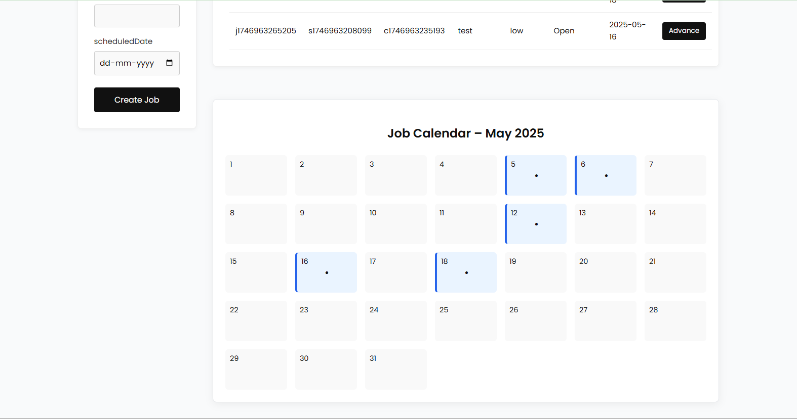
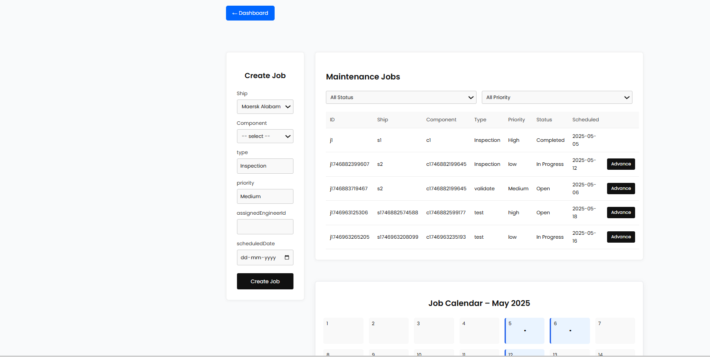
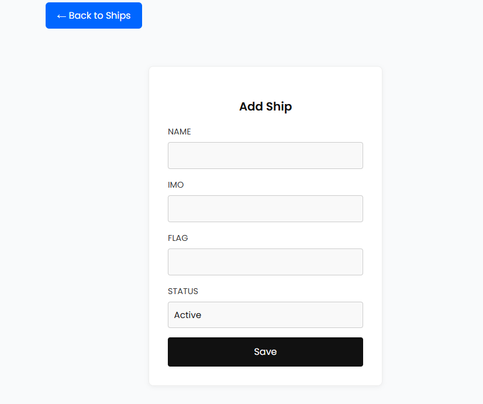
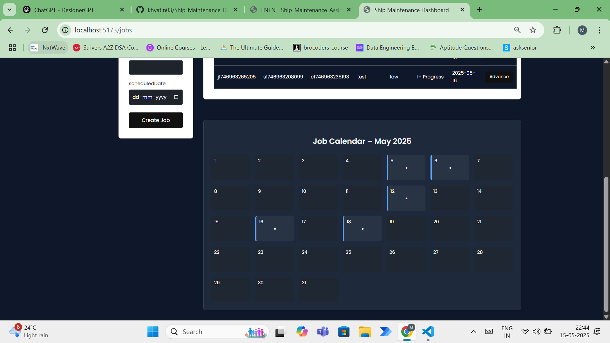

# Ship Maintenance Dashboard - Application Overview

The **Ship Maintenance Dashboard** is a comprehensive web application designed for managing ship maintenance operations. It provides a centralized platform for administrators, inspectors, and engineers to track ships, components, and maintenance jobs with role-based access control.

## Purpose

This application helps maritime organizations efficiently manage their fleet maintenance by:
- Tracking the status and details of all ships in the fleet
- Managing maintenance jobs and their assignments
- Monitoring component health and maintenance schedules
- Providing role-specific access to different features

## Key Features

- **Interactive Dashboard**: Visual representation of KPIs and maintenance status
- **Ship Management**: Add, view, edit, and track ships in the fleet
- **Job Management**: Create, assign, and monitor maintenance jobs
- **Role-Based Access Control**: Different access levels for Admins, Inspectors, and Engineers
- **Responsive Design**: Works on desktop and mobile devices
- **Dark/Light Theme**: User-selectable interface theme
- **Context-Based State Management**: Efficient global state handling with React Context API
- **Local Storage**: Persistent data storage between sessions

---

## Installation and Setup

### Prerequisites
- Node.js (v14 or higher)
- npm or yarn

### Installation Steps
1. Clone the repository
   ```
   https://github.com/khyatin03/Ship_Maintenance_Dashboard.git
   ```

2. Install dependencies
   ```
   npm install
   ```

3. Start the development server
   ```
   npm run dev
   ```

4. Build for production
   ```
   npm run build
   ```

5. Preview production build
   ```
   npm run preview
   ```

---
## Deployed Link
    ```
   https://ship-maintenance-dashboard-theta.vercel.app/
   ```

## Project Structure

### Root Files
- **App.jsx**: Main application component with routing and context providers
- **main.jsx**: Entry point that renders the App component
- **index.html**: HTML template with font imports and root element
- **tailwind.config.js**: Tailwind CSS configuration with Poppins font family

### Context Providers
The application uses the following context providers to manage global state:
- **AuthContext.jsx**: Manages user authentication, login/logout, and role-based access
- **ShipsContext.jsx**: Manages ship data including CRUD operations
- **ComponentsContext.jsx**: Manages component data for ships
- **JobsContext.jsx**: Manages maintenance jobs, assignments, and status

### Pages
The application includes the following pages:
- **LoginPage.jsx**: User authentication with email and password
- **DashboardPage.jsx**: Main dashboard with KPIs, charts, and notifications
- **ShipsPage.jsx**: Displays a list of ships with filtering and sorting options
- **ShipDetailPage.jsx**: Shows detailed information about a specific ship and its components
- **ShipFormPage.jsx**: Form for creating new ships with validation
- **ShipEditPage.jsx**: Form for editing existing ship details
- **JobsPage.jsx**: Displays and manages maintenance jobs with filtering by status

### Components
Organized by feature area:
- **Authentication**: Login forms and authentication-related components
- **Dashboard**: KPI cards, charts, and summary components
- **Ships**: Ship list, detail views, and form components
- **Components**: Ship component management interfaces
- **Jobs**: Job list, detail views, and assignment components
- **Notifications**: Alert and notification components

### Utilities
- **roleUtils.js**: Helper functions for role-based access control
- **localStorageUtils.js**: Functions for persistent data storage

---

## Routing Structure

The application uses `react-router-dom` to define routes. Below is the routing structure:

### Public Routes
- `/login`: Displays the login page for authentication

### Private Routes
Protected routes are wrapped in the `PrivateRoute` component, which ensures:
1. The user is authenticated
2. The user has the required role(s) to access the route

#### Routes and Roles
| Path               | Component          | Roles Allowed                  | Description                       |
|--------------------|--------------------|---------------------------------|-----------------------------------|
| `/`                | DashboardPage      | All authenticated users        | Main dashboard with KPIs and charts |
| `/ships`           | ShipsPage          | Admin, Inspector               | List of all ships in the fleet    |
| `/ships/new`       | ShipFormPage       | Admin, Inspector               | Form to create a new ship         |
| `/ships/:id`       | ShipDetailPage     | Admin, Inspector               | Detailed view of a specific ship  |
| `/ships/:id/edit`  | ShipEditPage       | Admin, Inspector               | Form to edit an existing ship     |
| `/jobs`            | JobsPage           | Admin, Inspector, Engineer     | List and management of jobs       |

### Fallback Route
- `*`: Redirects to `/` for undefined routes

---

## Role-Based Access Control

The application implements a comprehensive role-based access control system with three user roles:

### User Roles
1. **Admin**: Full access to all features
   - Can manage ships, components, and jobs
   - Can assign jobs to engineers
   - Can view all dashboard data

2. **Inspector**:
   - Can view and edit ships and components
   - Can create and assign maintenance jobs
   - Cannot delete critical data

3. **Engineer**:
   - Can view assigned maintenance jobs
   - Can update job status and add notes
   - Limited access to ship details

### Implementation
The `PrivateRoute` component in `App.jsx` handles access control:
```jsx
<PrivateRoute roles={["Admin", "Inspector"]}>
  <ShipsPage />
</PrivateRoute>
```

### Default User Accounts
The system comes with pre-configured user accounts for testing:
- Admin: admin@entnt.in / admin123
- Inspector: inspector@entnt.in / inspect123
- Engineer: engineer@entnt.in / engine123

---

## UI and Styling

The application features a clean, professional design with:
- **Tailwind CSS**: For utility-based styling
- **Poppins Font**: Modern, readable typography
- **Responsive Layout**: Adapts to different screen sizes
- **Dark/Light Theme**: Toggle between color schemes
- **Interactive Elements**: Hover effects and transitions for buttons and links

---

## Data Management

The application uses React Context API for state management and localStorage for persistence:

1. **Context Providers**: Each major data type (auth, ships, components, jobs) has its own context
2. **Local Storage**: Data persists between sessions using browser localStorage
3. **Seed Data**: Initial data is loaded when the application first runs

---

## Technologies Used

- **React 18**: Component-based UI library
- **React Router 6**: For routing and navigation
- **Context API**: For global state management
- **Tailwind CSS**: For styling and responsive design
- **Vite**: Fast build tool and development server

---

## Application Architecture Overview

The Ship Maintenance Dashboard follows a modern React application architecture with the following key components:

### Frontend Architecture
```
Ship Maintenance Dashboard
├── Context Layer (Global State)
│   ├── AuthContext
│   ├── ShipsContext
│   ├── ComponentsContext
│   └── JobsContext
├── Routing Layer (React Router)
│   ├── Public Routes
│   └── Private Routes (with Role-Based Access)
├── UI Components
│   ├── Pages
│   │   ├── Dashboard
│   │   ├── Ships
│   │   ├── Ship Details
│   │   ├── Jobs
│   │   └── Login
│   └── Reusable Components
│       ├── Navigation
│       ├── Forms
│       ├── Tables
│       ├── Cards
│       └── Charts
└── Data Persistence (localStorage)
```

### Data Flow
1. **User Interaction**: User interacts with UI components
2. **Context API**: Components dispatch actions to context providers
3. **State Update**: Context providers update global state
4. **UI Re-render**: Components re-render based on state changes
5. **Persistence**: Data is saved to localStorage for persistence between sessions

### Key Architectural Decisions
- **Client-Side Rendering**: The application is fully client-side rendered for a responsive user experience
- **Component-Based Architecture**: UI is built using reusable, composable components
- **Context API for State Management**: Uses React's built-in Context API instead of external state management libraries
- **Role-Based Access Control**: Implemented at the routing level for security
- **Local Storage for Persistence**: Data is stored locally in the browser

---

## User Interface

The application features a clean, professional interface with the following key screens:

### Dashboard

- KPI cards showing total ships (3), overdue components (0), jobs in progress (3), and completed jobs (1)
- Jobs by priority chart showing distribution of jobs by priority level
- Notifications panel displaying recent system events

### Ships Management

- Table view of all ships with columns for name, IMO number, flag, status, and actions
- Each ship has options to manage components or delete the ship
- "Add Ship" button for creating new ship entries

### Component Management

- Interface for managing ship components
- Table showing component details including name, serial number, installation date, and last maintenance date
- Form for adding new components to a ship

### Job Calendar

- Monthly calendar view showing scheduled maintenance jobs
- Visual representation of job dates with highlighted days
- Helps in planning and scheduling maintenance activities

### Create Job Interface

- Form for creating new maintenance jobs
- Fields for selecting ship, component, job type, priority, and scheduled date
- Table view of existing jobs with filtering options

### Add Ship Form

- Form for adding new ships with fields for name, IMO number, flag, and status
- Clean, minimalist design with clear labels and a prominent save button

### Dark Mode Support

- Application supports dark mode for reduced eye strain in low-light environments
- Toggle between light and dark themes with a single click
- Consistent styling across all components in both themes

---

## Known Issues and Limitations

1. **Data Persistence**:
   - Data is stored in localStorage, which has limited storage capacity (typically 5-10MB)
   - Data is browser-specific and not synchronized across devices
   - Data can be lost if the user clears browser data

2. **Authentication**:
   - Basic authentication with no password recovery mechanism
   - No session timeout or automatic logout for security
   - No support for multi-factor authentication

3. **Performance**:
   - May experience performance issues with large datasets due to localStorage limitations
   - No data pagination implemented for large lists

4. **Browser Compatibility**:
   - Optimized for modern browsers (Chrome, Firefox, Safari, Edge)
   - Limited support for older browsers or Internet Explorer

5. **Offline Functionality**:
   - No offline mode or data synchronization when connection is restored
   - Requires internet connection for initial load of assets

6. **Mobile Experience**:
   - While responsive, some complex tables may require horizontal scrolling on small screens
   - Touch interactions not fully optimized for all mobile devices

7. **Data Validation**:
   - Basic form validation implemented, but complex validation rules are limited
   - No server-side validation as this is a client-only application

---

## Technical Decisions

### Why React?
React was chosen for its component-based architecture, which allows for reusable UI elements and efficient rendering through the virtual DOM. This makes it ideal for a dashboard application with multiple interactive elements.

### Why Context API instead of Redux?
The Context API was selected over Redux for state management because:
- The application has a moderate complexity level that doesn't require Redux's overhead
- Context API is built into React, reducing bundle size and dependencies
- The application's state can be logically divided into separate contexts (auth, ships, components, jobs)

### Why localStorage instead of a Backend?
The decision to use localStorage for data persistence was made to:
- Create a fully client-side application that can run without a server
- Simplify deployment and reduce infrastructure requirements
- Enable quick prototyping and demonstration
- Allow for potential future integration with a real backend API

### Why Tailwind CSS?
Tailwind CSS was chosen for styling because:
- It provides utility-first classes that speed up development
- It ensures consistency across the UI
- It's highly customizable while maintaining a small footprint
- It works well with component-based architectures

### Why Vite instead of Create React App?
Vite was selected as the build tool because:
- It offers significantly faster development server startup
- It provides quicker hot module replacement
- It has better support for modern JavaScript features
- It results in optimized production builds

### Single-Page Application (SPA) Approach
The application is built as an SPA to:
- Provide a seamless user experience without page reloads
- Reduce server load by only loading assets once
- Enable complex UI interactions that persist across views
- Allow for potential offline functionality in future versions

---


---

## License

This project is licensed under the MIT License.
